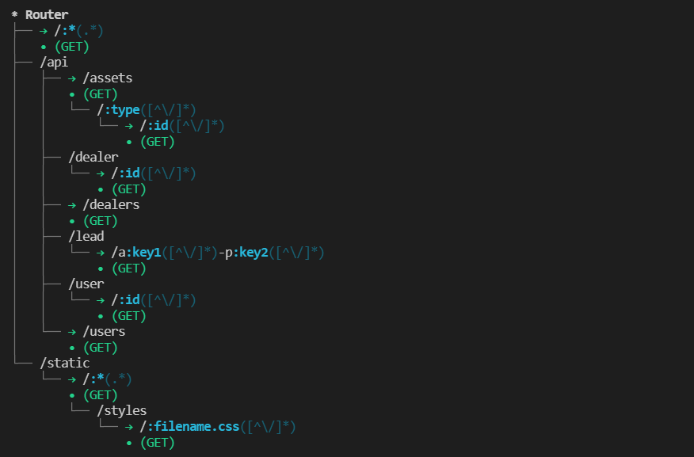

<p align="center">

<a  href="https://github.com/prostojs/router/blob/main/LICENSE">
    
</a>
</p>

# Fast and Robust URI-router for NodeJS. [](https://github.com/prostojs/router/actions/workflows/ci.yml)

This is framework agnostic router that is [extremely fast](https://github.com/prostojs/router-benchmark). It's as fast as `find-my-way` and even faster. It's written completely on TypeScript.

The aim of the router is to properly parse URI and find the handler in the shortest possible time. It doesn't have any problems with url-encoded tricky URIs. It will deliver all the params in the context. It parses params and wildcards in proper manner. It allows to use complex wildcards and parameters with regex. It does not call handlers but returns handlers. You must specify the type of handler functions yourself for your use case.

If you want to see a benchmark comparison with the most commonly used routers, see [here](https://github.com/prostojs/router-benchmark).<br>


 - [Quick Start](./README.md#quick-start)
 - [Install](./README.md#install)
 - [Router options](./README.md#router-options)
 - [Handlers Type](./README.md#handlers-type)
 - [Route specific Handler Type](./README.md#route-specific-handler-type)
 - [Lookup result](./README.md#lookup-result)
 - [Lookup alias](./README.md#lookup-alias)
 - [Parametric routes](./README.md#parametric-routes)
 - [Wildcards](./README.md#wildcards)
 - [Optional Parameters](./README.md#optional-parameters)
 - [Retrieving params](./README.md#retrieving-params)
 - [Register routes shortcuts](./README.md#register-routes-shortcuts)
 - [Register all](./README.md#register-all)
 - [Path builders](./README.md#path-builders)

### Quick Start
```ts
import { ProstoRouter } from 'prosto-router'
import http from 'http'

const router = new ProstoRouter()

router.on('GET', '/api/path', () => 'ok')

const server = http.createServer((req, res) => {
    const found = router.lookup(req.method, req.url)
    if (found) {
        res.end(found.route.handlers[0]())
    } else {
        res.statusCode = 404
        res.end('404 Not Found')
    }
})
server.listen(3000, (err) => {
    if (err) return console.error(err)
    console.log('Server is listening 3000')
})
```

```ts
// `require` example
const { ProstoRouter } = require('@prostojs/router')
const http = require('http')

const router = new ProstoRouter()
```

### Install

`npm install @prostojs/router`

### Router options
```ts
const router = new ProstoRouter({
    // Ignore trailing URI slash
    // (by default = false)
    ignoreTrailingSlash: false,

    // Ignore URI case (by default = false)
    ignoreCase: false,
    
    // By default duplicate paths are enabled,
    // the handlers are collected into an array
    disableDuplicatePath: false,

    // You can put any logger that implements 
    // TConsoleInterface interface
    logger: ...,

    // Specify which log messages to see 
    // (DEBUG, INFO, LOG, WARN, ERROR, NOTHING)
    logLevel: EProstoLogLevel.INFO,  

    // enables caching of mapping of
    // incoming paths to the handlers
    // which increases the speed of routing
    // (by default 0)
    cacheLimit: 50
})
```

### Handlers Type
```ts
type MyHandlerType = (
    req: ClientRequest,
    res: ServerResponse,
    ctx: TProstoLookupContext
) => string
const router = new ProstoRouter<MyHandlerType>()

router.on(
    'GET',
    '/api/path',
    (req: ClientRequest, res: ServerResponse, ctx: TProstoLookupContext) => 'ok'
)
```

### Route specific Handler Type
```ts
interface ParamsType = {}

type MyHandlerType = (
    req: ClientRequest,
    res: ServerResponse,
    ctx: TProstoLookupContext
) => string

router.on<ParamsType, MyHandlerType>(
    'GET',
    '/api/path',
    (req: ClientRequest, res: ServerResponse, ctx: TProstoLookupContext) => 'ok'
)
```

### Lookup result
Lookup returns `TProstoLookupResult | undefined`
```ts
interface TProstoLookupResult<HandlerType> {
    route: TProstoRoute<HandlerType>    // the matched route itself
    ctx: TProstoLookupContext           // the lookup context
                                        // (contains params that were parsed from the URI)
}
```

```ts
// The real interface has more props
// I highlight here the main props
interface TProstoRoute<HandlerType> {
    // normallized path that was registered
    path: string

    // array of handlers in registration order
    handlers: HandlerType[]

    // the route has only one static segment
    // (segment is the whole url)
    isStatic: boolean

    // the route has at least one parameter
    // (it can have static segments as well)
    isParametric: boolean

    // the router has wildcard(s) and static
    // segment(s) (optionally)
    isWildcard: boolean
}
```

```ts
interface TProstoLookupContext<ParamsType = Record<string, string | string[]>> {
    params: ParamsType  // parameters from parametric routes or wildcards
}
```

### Lookup alias
`router.find` works similarly to `router.lookup`

### Parametric routes
Parameter starts with `:`.
If you want to have colon in your path without defining a parameter you must escape it with backslash like so `'/api/colon\\:novar'`.
Parameters can be separated with hyphen like so `'/api/:key1-:key2'`
It's possible to specify RegExp for parameters `'/api/time/:hours(\\d{2})h:minutes(\\d{2})m'`
```ts
// simple single param
router.get('/api/vars/:key', () =>  'ok')

// two params separated with hyphen
router.get('/api/vars/:key1-:key2', () =>  'ok')

// two params with regex
router.get('/api/time/:hours(\\d{2})h:minutes(\\d{2})m', () =>  'ok')

// two params separated with slash
router.get('/api/user/:name1/:name2, () =>  'ok')

// three params with the same name (leads to an array as a value)
router.get('/api/array/:name/:name/:name, () =>  'ok')
```

### Wildcards
Widlcard is specified with asterisk `'*'`

There are several options available:
1. It can be at the beginning of path, in the middle of the path or at the end of the path.
2. It's possible to have several wildcards.
3. It's possible to have widlcards mixed with params.
4. It's possible to pass regex to wildcard.
```ts
// the most common usage (will match all the URIs that
// start with `/static/`)
router.get('/static/*', () =>  'ok')

// will match all the URIs that start with `/static/`
// and end with `.js`
router.get('/static/*.js', () =>  'ok')

// will match all the URIs that start with `/static/`
// and have `/test/` in the middle
router.get('/static/*/test/*', () =>  'ok')

// will match all the URIs that start with `/static/[numbers]`
router.get('/static/*(\\d+)', () =>  'ok')
```

### Optional Parameters

A parametric (wildcard) route can include optional parameters. If you wish to define optional parameters, they should appear at the end of the route. It is not permitted to have obligatory parameters after an optional parameter, and static segments should not appear after optional parameters, except when using `-` and `/` as separators between parameters.

Optional parameters may be omitted when matching a route, and the corresponding handler will still be found.

**Note:**
A parametric route with optional parameters is treated as a wildcard during lookup, which can reduce routing performance. Please use this feature carefully.

To define a parameter (wildcard) as optional, simply add `?` at the end.

```ts
// Optional parameter
router.get('/api/vars/:optionalKey?', () => 'ok')

// Optional wildcard
router.get('/api/vars/:*?', () => 'ok')

// Several optional parameters
router.get('/api/vars/:v1/:v2?/:v3?', () => 'ok')
```

In the above example, the router allows routes with optional parameters to be defined using the `?` symbol at the end of the parameter name. For instance, `/api/vars/myKey` and `/api/vars/` are both valid routes for the first example. Similarly, the second example allows routes like `/api/vars/param1/param2` and `/api/vars/` to be matched. Lastly, the third example permits routes with one, two, or three parameters to be matched, with any combination of parameters being optional.

### Retrieving params
```ts
router.get('/api/:key1-:key2/*/array/:name/:name/:name', () =>  'ok')
const lookupResult = router.lookup('/api/val1-val2/random/part/array/name1/name2/name3')
if (lookupResult) {
    console.log(lookupResult.ctx)
    // {
    //     params: {
    //         key1: 'val1',
    //         key2: 'val2',
    //         '*': 'random/part',
    //         name: ['name1', 'name2', 'name3']
    //     }
    // }    
}
```

### Register routes shortcuts
```ts
router.on('GET', '/api/path', () => 'ok')
// is equal to
router.get('/api/path', () => 'ok')

router.on('POST', '/api/path', () => 'ok')
// is equal to
router.post('/api/path', () => 'ok')

// and so on
router.post('/api/path', () => 'ok')
router.put('/api/path', () => 'ok')
router.patch('/api/path', () => 'ok')
router.delete('/api/path', () => 'ok')
router.options('/api/path', () => 'ok')
router.head('/api/path', () => 'ok')
```

### Register all
```ts
router.on('*', '/api/path', () => 'ok')
// is equal to
router.all('/api/path', () => 'ok')
```

### Path builders
When you define a new route you receive a path builder for it
```js
const { getPath: pathBuilder } = router.get('/api/path', () => 'ok')
console.log(pathBuilder())
// /api/path

const { getPath: userPathBuilder } = router.get('/api/user/:name', () => 'ok')
console.log(userPathBuilder({
    name: 'John'
}))
// /api/user/John

const { getPath: wildcardBuilder } = router.get('/static/*', () => 'ok')
console.log(wildcardBuilder({
    '*': 'index.html'
}))
// /static/index.html

const { getPath: multiParamsBuilder } = router.get('/api/asset/:type/:type/:id', () => 'ok')
console.log(userPathBuilder({
    type: ['CJ', 'REV'],
    id: '443551'
}))
// /api/asset/CJ/REV/443551
```

```ts
// typescript example
interface MyParamsType = {
    name: string
}

const { getPath: userPathBuilder } = router.get<MyParamsType>('/api/user/:name', () => 'ok')

console.log(userPathBuilder({
    name: 'John'
}))
// /api/user/John
```

### Print tree

Print the representation of routes in tree:
```js
const router = new ProstoRouter()

router.on('GET', '/api/users', () => {})
router.on('GET', '/api/user/:id', () => {})
router.on('GET', '/api/dealers', () => {})
router.on('GET', '/api/dealer/:id', () => {})
router.on('GET', '/api/assets', () => {})
router.on('GET', '/api/assets/:type/:id', () => {})
router.on('GET', '/api/lead/a:key1-p:key2', () => {})
router.on('GET', 'static/*', () => {})
router.on('GET', 'static/*/styles/:filename.css', () => {})
router.on('GET', '*', () => {})

router.toTree()
```


